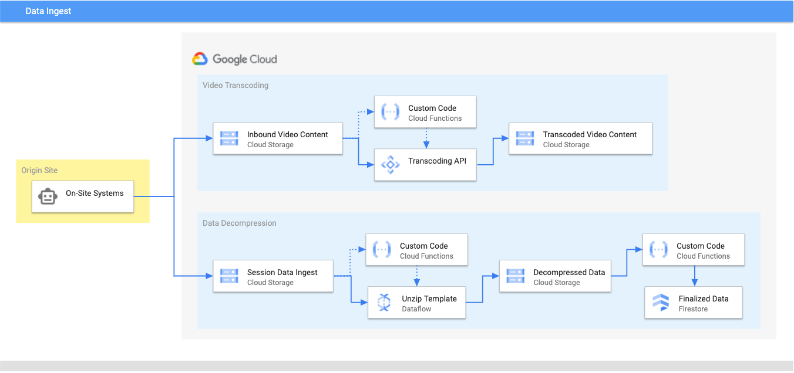

# Event-Driven Video Transcoding and Metadata Ingest

## Overview

This demo uses Google Cloud Functions, Cloud Storage, Dataflow, and Transcoder
API to create a workflow where videos and their metadata are uploaded and
automatically processed according to the architecture below.



## Bootstrapping

* have an authenticated `gcloud` instance with the ability to enable additional
  APIs.
* clone this repo and `cd` to the checked out code 
* copy `envars.sample` to `envars`
  ```
  cp envars.sample envars
  ```
* populate envars with the proper information:
  ```
  export PROJECT_ID=$(gcloud config get-value project)
  export REGION=us-central1
  export DATA_IN_BKT=data_in_1234
  export DATA_OUT_BKT=data_out_1234
  export VIDEO_IN_BKT=video_in_1234
  export VIDEO_OUT_BKT=video_out_1234
  export VIDEO_FUNC=video_transcode 
  export DECOMPRESS_FUNC=event_decompressor
  export INGEST_FUNC=firestore_ingest
  export SA_KEY=cloudfunctions.json
  ```
  * `PROJECT_ID` - GCP Project to deploy this to
  * `REGION` - Region to use
  * `SA_KEY` - The JSON key file for your [default Cloud Functions service
    account](https://cloud.google.com/functions/docs/securing/function-identity)
    You can certainly do this with a more limited service account, but gave
    owner privs to this for the demo. You could also use individual service
    accounts for the different functions. It was just beyond the scope of this
    demo.
* run `bootstrap.sh`
  ```
  ./bootstrap.sh
  ```
* once complete, confirm your functions have been deployed:
  ```
  gcloud functions list
  ```

## Usage

* source your envars file:
  ```
  source envars
  ```
* add a video to be transcoded
  ```
  gsutil cp data/1600APMVCA-01.mp4 gs://$VIDEO_IN_BKT
  ```
* add a zip file to be transcoded
  ```
  gsutil cp data/1600APMVCA-01.zip gs://$DATA_IN_BKT
  ```
* Profit! You can check Cloud Logging to see the Functions progress through
  their workflows. You'll eventually end up with transcoded videos will be in
  `$VIDEO_OUT_BKT` in a subdirectory and the unzipped JSON sample file will be
  ingested into Firestore.

## Cleanup

* run `cleanup.sh`
  ```
  ./cleanup.sh
  ```

## Issues

Please feel free to open an issue, send me a message, or whatever is expedient.